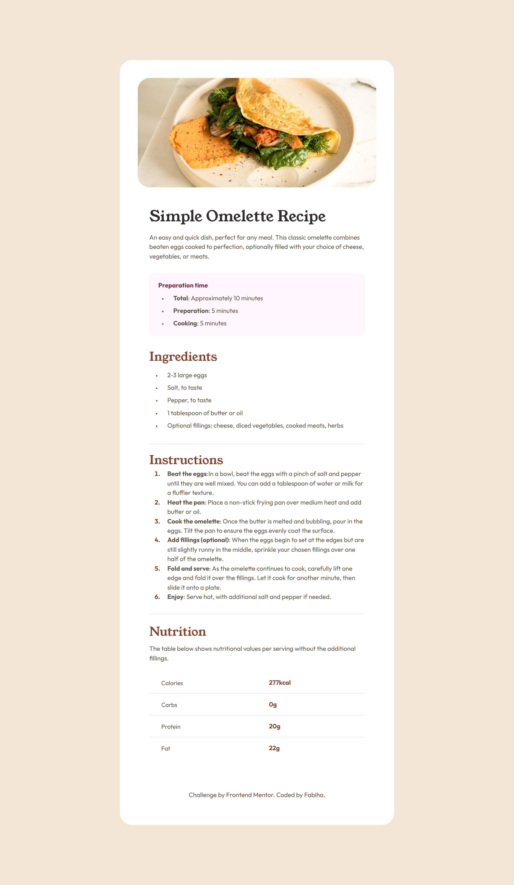
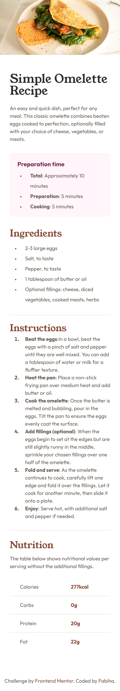

Frontend Mentor - Recipe page solution

This is a solution to the Recipe page challenge on Frontend Mentor. Frontend Mentor challenges help you improve your coding skills by building realistic projects.

📑 Table of contents

📋 Overview

📸 Screenshot

🔗 Links

🛠️ My process

🧱 Built with

🎯 What I learned

🔄 Continued development

📚 Useful resources

👩‍💻 Author

🙏 Acknowledgments

📋 Overview

This is a responsive recipe page that displays the preparation time, ingredients, cooking instructions, and nutritional information. It was built to match the design provided by Frontend Mentor.

📸 Screenshot

🔗 Links

🔧 Solution URL: GitHub Repo(https://github.com/Fabiha517/Recipe_page.git)

🌐 Live Site URL: Live Page(https://Fabiha517.github.io/Recipe_page/)

🛠️ My process

🧱 Built with

Semantic HTML5 markup

CSS custom properties

Mobile-first workflow

🎯 What I learned

I improved my understanding of how to:

Use ::marker to style list bullets and numbers.

Use border-collapse: collapse; in tables.

Apply line-height and padding correctly for vertical spacing.

Create responsive layouts using media queries, especially for 1440px screens.

🔄 Continued development

I want to focus more on improving:

Accessibility features like aria-labels.

Better layout practices using CSS Grid.

Animation or hover effects for interactive elements.

📚 Useful resources

MDN Web Docs - For CSS property references.

CSS Tricks - For layout ideas and tips.

Frontend Mentor Community - For advice and feedback.

👩‍💻 Author

Name: Fabiha

Frontend Mentor: @Fabiha517

GitHub: Fabiha517

🙏 Acknowledgments

Special thanks to the Frontend Mentor community  for guidance and feedback throughout this project. Your support made learning more fun and productive! 💙

